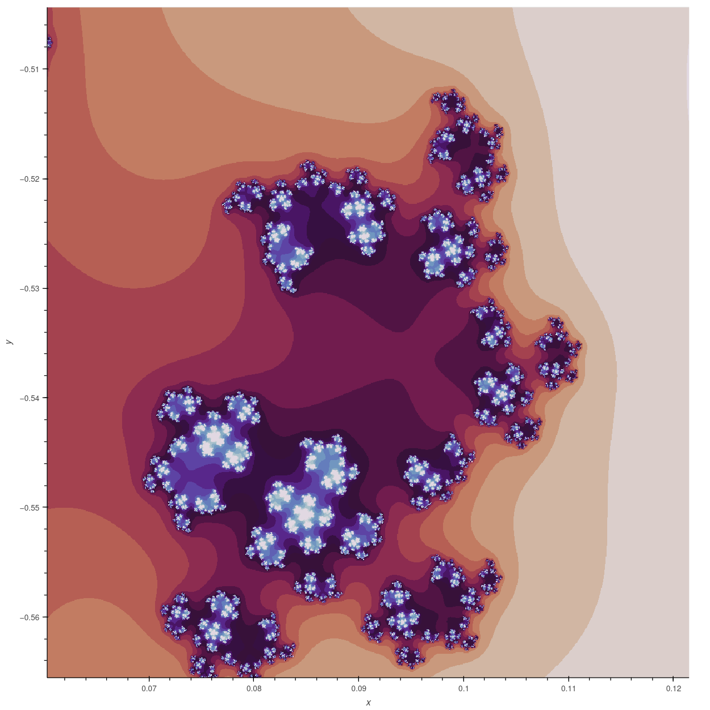
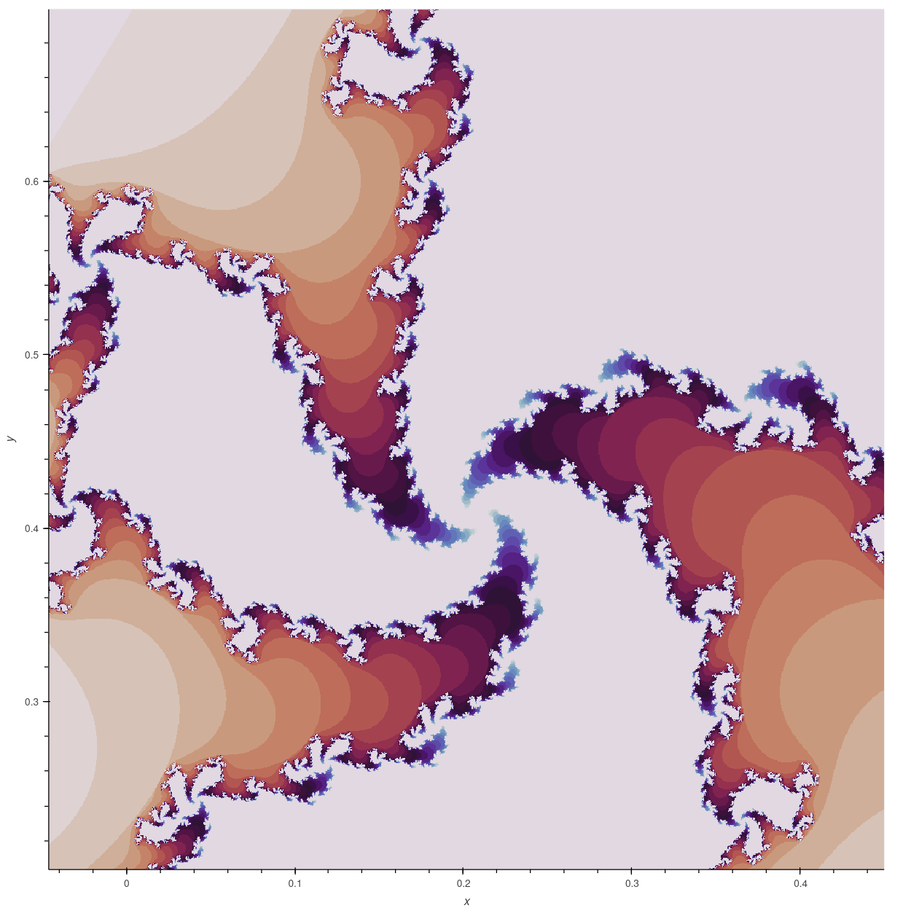

# Julia Fractals

Generating Julia fractals based on an iterative function. The used algorithm computes the number of iterations for given function until divergence for each pixel in the specified coordinate space. The fractals are visualized using Holoviews and the Julia set is computed through parallelized Numba-accelerated calculations.

## Installation

You can install needed dependencies using provided `requirements.txt` file (`pip install -r requirements.txt`)

## Examples

