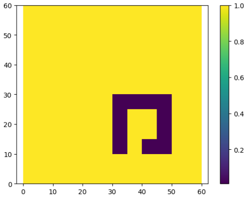
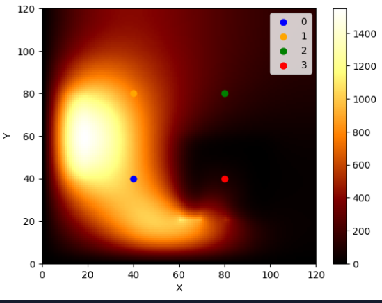

# Heat Transfer Simulation

This project generates a heat map by numerically (finite-difference method) solving partial differential equation (PDE) of heat diffusion. 

## Overview of the problem

We are given a metal plate of some given diffusion coefficient, a structure (cutouts out of the plate) of lower diffusion coefficient, and 2 pulsating heat sources. The result is a diffused heat map for 6 different resolutions. 

## Examples

*Yellow is the metal plate, dark blue is the cutout of lower diffusion coefficient.*

