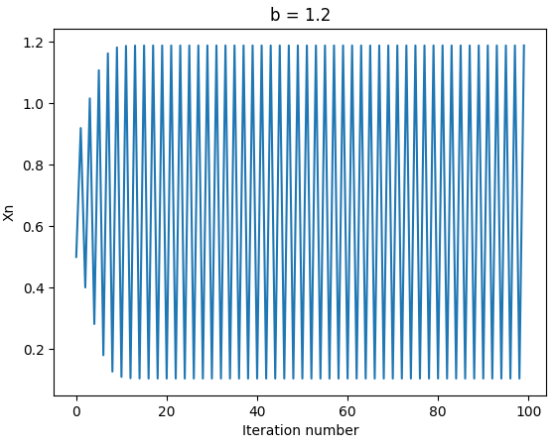
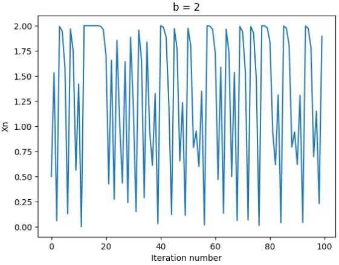
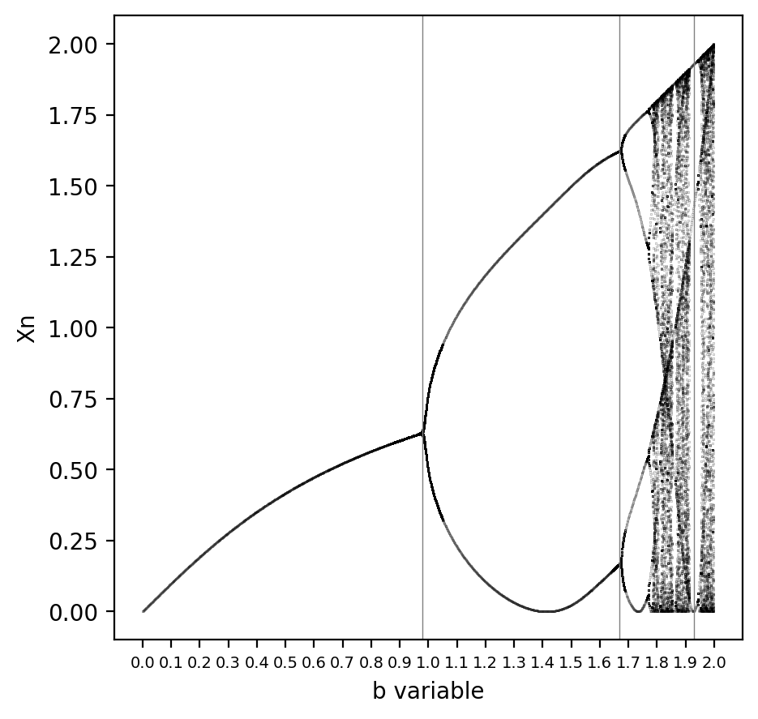
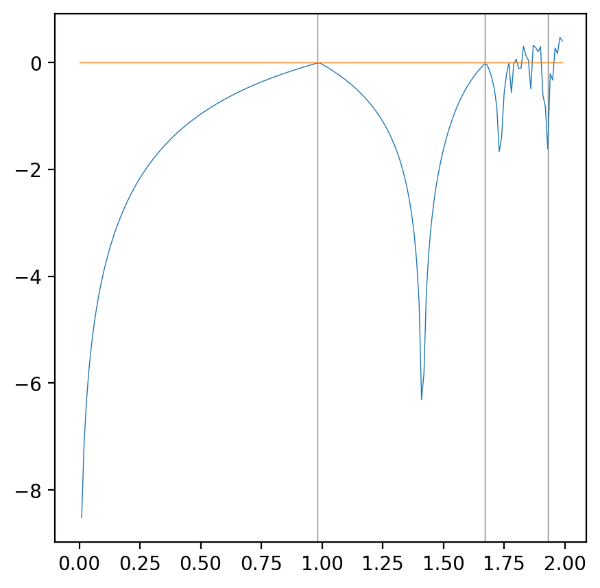
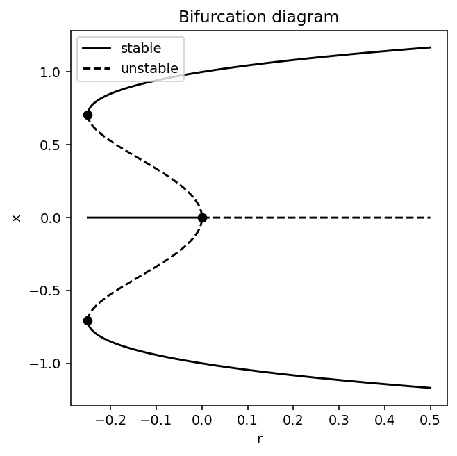
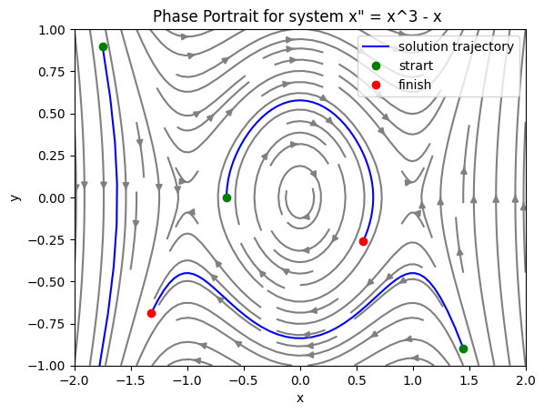

# Nonlinear Dynamics

A collection of works on nonlinear dynamics. All calculations and visualizations are done using numpy and matplotlib.

## Overview

- Analysis of a discrete dynamic system (presented as an equation xn+1 = f(xn)).
  * Plots the mapping, bifurcation diagram and the lyapunvo exponent.
- Analysis of a 1d differential equation (x' = f(x)).
  * Fixed points are found empyrically, program plots the bifurcation diagram of the system with considiration of the stability of fixed points
- Two-dimensional system analysis (x'' = f(x', x))
  * Plots the phase portrait of the system alongside some solutions' trajectories   

## Examples

